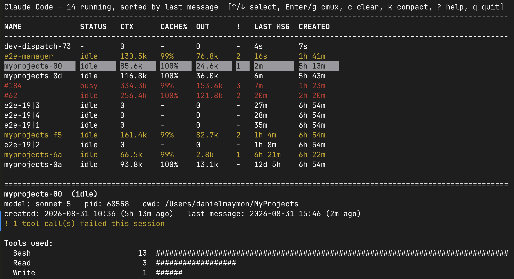

# claude-live-dashboard



A live terminal dashboard for monitoring all your locally-running [Claude Code](https://claude.com/claude-code) CLI sessions at once — built to make it easy to spot a session that's burning context, looping on the same tool call, or stalled while busy.


## What it does

Claude Code writes a small registry file per running session (`~/.claude/sessions/*.json`) and a full JSONL transcript per session (`~/.claude/projects/*/`). This tool reads both, incrementally tails every transcript, and renders a live-updating table in your terminal — no browser, no server, just `curses`.

For each session you get:

- **Model** currently in use (Sonnet/Opus/Fable, etc.)
- **Context size** of the last turn, with warning/critical color thresholds
- **Output tokens** for the last turn, plus cumulative lifetime output in the detail panel
- **Cache hit ratio** for that turn (low cache = expensive turn)
- **Tool usage breakdown** (which tools, how often) and any Skills invoked
- **Tool error count**
- **Loop detection** — flags a session repeating the same tool call back-to-back
- **Stall detection** — flags a session stuck `busy` for an unusually long time
- Last-message time and session-created time, live-sorted by most recent activity

Plus a **live usage banner** at the top showing your account's plan usage (5-hour session window and 7-day weekly window) — the same numbers Claude Code's own `/usage` shows, refreshed in the background without blocking the UI.

You can also act directly on a session from the dashboard: send `/clear` or `/compact`, close (terminate) it, rename it, or launch a brand-new one with a chosen model — all without switching tabs.

## Why

If you run several Claude Code sessions in parallel (e.g. across `cmux` workspaces), it's easy to lose track of which one has quietly ballooned to a huge context window or gotten stuck retrying the same failing tool call. This dashboard surfaces that at a glance instead of tabbing through every session individually.

## Requirements

- Python 3 (standard library only — `curses`, no third-party dependencies)
- macOS or Linux terminal
- Optional: [cmux](https://github.com) terminal multiplexer, for the jump-to-session feature

## Usage

```bash
python3 claude_live_dashboard.py
```

### Keybindings

| Key | Action |
|---|---|
| `↑` / `↓` | Select a session row |
| `Enter` / `g` | Jump to that session's tab (requires cmux) |
| `c` | Send `/clear` to the selected session (asks `y/N`; queues if the session is busy) |
| `k` | Send `/compact` to the selected session (asks `y/N`; queues if the session is busy), followed by a trivial `ok` so CTX/%LIM refresh right away instead of staying stale until the session's next real turn |
| `x` | Close (terminate) the selected session (asks `y/N`). Closes its cmux tab if it has one, otherwise sends `SIGTERM` directly. Refused for Claude Desktop sessions — close those from the Desktop app itself. |
| `n` | Launch a new session: type a name, pick a model (`sonnet`/`opus`/`fable`) with `↑`/`↓`, Enter to launch. Opens a new cmux tab running `claude --model <model> --permission-mode auto`, then renames it. |
| `r` | Rename the selected session: prefilled with its current name, editable, Enter sends `/rename` |
| `PgUp` / `PgDn` | Scroll the tool list in the detail panel |
| `?` | Toggle a glossary explaining statuses, columns, and keybindings |
| `q` | Quit |

### Columns

| Column | Meaning |
|---|---|
| `NAME` | Session name. If two sessions share a name (e.g. both renamed `#1`), the PID is appended (`name·pid`) so they're never indistinguishable. |
| `STATUS` | `idle`, `busy` (generating), `shell` (running a command), `waiting` (blocked on a permission dialog), or `desktop`/`desktop~active` for Claude Desktop sessions (which don't report a real status — this is a best-effort transcript-recency guess instead) |
| `MODEL` | Model of the last real turn (Sonnet/Opus/Fable). Skips Claude Code's own `<synthetic>` placeholder turns that never actually called a model. |
| `CTX` | Context size of the *last* turn only (cache read + cache creation + input tokens). A trailing `?` means `/compact` ran but there's been no turn since, so the number is stale. |
| `%LIM` | `CTX` as a percentage of *this session's model's* real context window (1M for Sonnet/Opus/Fable 5, 200K default otherwise) — the number to actually watch for compacting. Yellow at 60%, red at 85%. |
| `LAST OUT` | Output tokens generated by the *last* turn only (not the lifetime total, which is in the detail panel) |
| `!` | Number of active warnings for that session |
| `LAST MSG` | Time since the last real conversation turn |
| `CREATED` | Time since the session's process started |

## How it works

- Session discovery: polls `~/.claude/sessions/*.json` for live PIDs.
- Transcript parsing: tails each session's `.jsonl` transcript from a saved byte offset, so re-reads stay cheap even for very long sessions.
- `/clear` detection: the tool recognizes an immediate `/clear` command in the transcript and resets its own counters right away, rather than waiting for the next turn's usage stats (which lag behind the model's actual reset).
- cmux integration: resolves a session's `sessionId` to its exact cmux workspace/surface and focuses it directly, rather than just switching workspace-level focus.
- Usage banner: polls the same undocumented endpoint Claude Code's own `/usage` reads (`api.anthropic.com/api/oauth/usage`), authenticated with the OAuth token from the macOS Keychain, on a background thread so the network call never blocks the render loop. That endpoint rate-limits hard once more than one thing polls it (this dashboard running twice, other tools, `/usage` itself), so a failed poll keeps showing the last good reading — marked stale — instead of blanking out.
- Resize handling: catches `SIGWINCH` and calls `curses.resizeterm()` so the layout actually redraws correctly after a terminal resize or font-size change, instead of getting stuck at the size it started with.
- Session actions (`c`/`k`/`x`/`n`/`r`) all go through cmux's CLI — typing into the target pane or opening/closing tabs — the same way you'd do it by hand.

## Notes

This was built as a personal tool against the current on-disk layout of Claude Code's session/transcript files. That layout is an implementation detail, not a stable public API, so future Claude Code versions may change it in ways that break this script.
